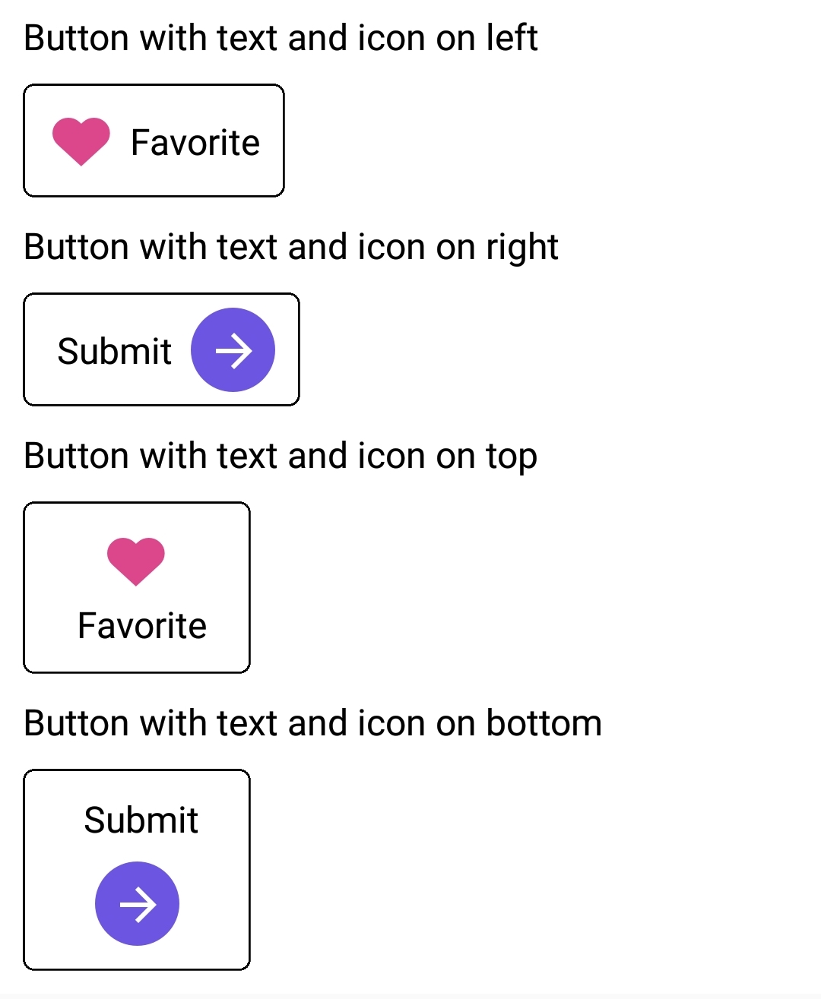

<h1>Introduction</h1>
INTUZ presents a very handy React Native component which allows you to have a ready-made Button controller with support for both image and text inside your next mobile app projects. Try it your self by following below integration, Enjoy!

<br>
<h1>Features</h1>

- Support of image and text both
- Customizable style for button and text
- Positioning image alignment with text easily
- Customizable space between text and image
- Manageable both state of button (selected and non-selected)

<br>


<h1>Getting Started</h1>

> Import Button in your .js file

```
import INTButton from './app/component/INTButton'   
```

> Render your Button

```
<INTButton  
    buttonStyle = {{alignSelf:'flex-start', padding : 10, borderRadius:5 , borderWidth:1, borderColor:'black',height : 50,marginTop:10}}
    buttonStyleSelected = {{backgroundColor : 'transparent'}}
    title = 'Button'
    titleSelected = 'Favorite' 
    icon = {require('./images/ic_heart.png')}
    iconSelected = {require('./images/top_heart_selected.png')}
    iconPosition = 'left'
    isSelected = {true}
    spaceBetweenIconAndTitle = {2}
    titleStyle = {{color : 'black'}}
    titleStyleSelected = {{color : 'black'}}
    onPress = {() => {console.log('Button Tapped')}}
/>
```
<br>
<h1>Properties</h1>

| Available properties | Type | Default Value | Required | Description |
|--------------------------|------------------------|-------------------------------|----------|-------------------------------------------------------------------------------------------------------------------------------------------------------------------------|
| buttonStyle | Style | {backgroundColor:'white', padding : 5,justifyContent:'flex-start',alignItems:'center',overflow:'hidden'} | No | Style your button |
| buttonStyleSelected | Style  | - | No | Style of button for selected state when isSelected is true |
| title | String | - | Yes | Title of button |
| titleSelected | String | - | No | Title of button for selected state when isSelected is true |
| icon | Image | - | No | Icon to display in button |
| iconSelected | Image  | - | No | Icon to display in button for selected state when isSelected is true |
| iconPosition | String (left, right, top, bottom)  | left | No | Set your icon position align to the title |
| isSelected | Boolean (true/false)  | FALSE | No | Set your button state  |
| spaceBetweenIconAndTitle | Number  | 10 | No | Set the space between the icon and title |
| titleStyle | Style  | {color:'blue',fontSize : 16} | No | Title style what ever you want to set and it will override the default |
| titleStyleSelected | Style  | - | No | Title style what ever you want to set and it will override the default for selected state when isSelected is true |
| onPress | Function   | - | No | Callback function |

<br>
<h1>Bugs and Feedback</h1>

For bugs, questions and discussions please use the Github Issues.

<br>
<h1>License</h1>

Copyright (c) 2018 INTUZ.
<br><br>
Permission is hereby granted, free of charge, to any person obtaining a copy of this software and associated documentation files (the "Software"), to deal in the Software without restriction, including without limitation the rights to use, copy, modify, merge, publish, distribute, sublicense, and/or sell copies of the Software, and to permit persons to whom the Software is furnished to do so, subject to the following conditions:
<br><br>
THE SOFTWARE IS PROVIDED "AS IS", WITHOUT WARRANTY OF ANY KIND, EXPRESS OR IMPLIED, INCLUDING BUT NOT LIMITED TO THE WARRANTIES OF MERCHANTABILITY, FITNESS FOR A PARTICULAR PURPOSE AND NONINFRINGEMENT. IN NO EVENT SHALL THE AUTHORS OR COPYRIGHT HOLDERS BE LIABLE FOR ANY CLAIM, DAMAGES OR OTHER LIABILITY, WHETHER IN AN ACTION OF CONTRACT, TORT OR OTHERWISE, ARISING FROM, OUT OF OR IN CONNECTION WITH THE SOFTWARE OR THE USE OR OTHER DEALINGS IN THE SOFTWARE.

<h1></h1>
<a href="http://www.intuz.com">

</a>
